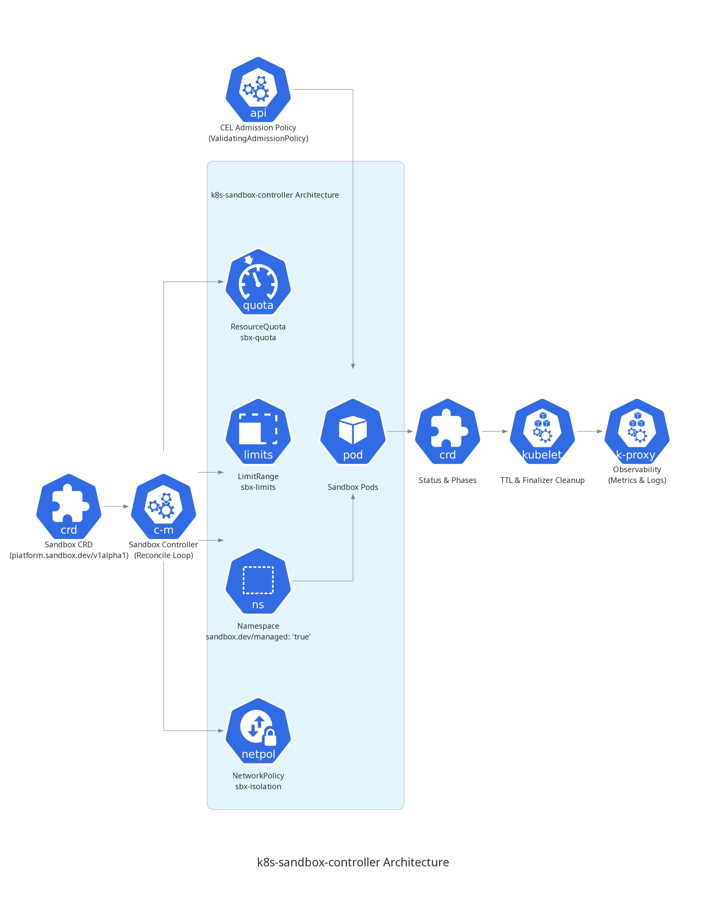

# k8s-sandbox-controller

k8s-sandbox-controller is an automated Kubernetes operator built with Go, Kubebuilder, and controller-runtime that provisions ephemeral developer sandbox environments with multi-tenant isolation, deterministic resource quotas, in-tree CEL admission security, self-cleaning TTL lifecycles, and native Prometheus observability.

## Architecture

The operator manages the full sandbox lifecycle across five operational stages:

| Path | Purpose | Flow |
| :--- | :--- | :--- |
| **CRD Ingestion** | Declare sandbox specs with CEL validation rules | Developer -> kubectl -> Sandbox CR |
| **Hermetic Isolation** | Provision child namespace, quotas, limits, and network policies | Controller -> Namespace, Quota, LimitRange, NetPol |
| **In-Tree Admission** | Enforce non-root execution and trusted registries without webhooks | ValidatingAdmissionPolicy (CEL) -> API Server |
| **Drift Healing & TTL** | Heal out-of-band tampering and execute ordered finalizer teardown | Watches -> Reconciler -> Namespace Teardown |
| **Observability** | Export reconciliation duration, status, and drift metrics | Controller Manager -> Prometheus (`:8443/metrics`) |



## Service Level Objectives (SLOs) & Reliability

Controller reliability and reconciliation performance standards are monitored via Prometheus metrics:

| Objective (SLO) | Indicator (SLI) | Alert Trigger |
| :--- | :--- | :--- |
| **100% Reconcile Convergence** | Reconciliation error rate | `rate(sandbox_reconcile_total{status="error"}[5m]) > 0` |
| **< 500ms Reconcile Latency** | Reconciliation loop p99 duration | `histogram_quantile(0.99, sum(rate(sandbox_reconcile_duration_seconds_bucket[5m])) by (le)) > 0.5` |
| **Zero Lingering Sandboxes** | TTL expired teardown count | `sandbox_ttl_expired_total > 0` (unresolved after TTL) |
| **100% Drift Self-Healing** | Drift correction event rate | `rate(sandbox_drift_healed_total[5m]) > 0` |
| **High Availability Controller** | Manager pod readiness probe | `up{job="k8s-sandbox-controller-manager"} == 0` |

## Tech Stack

| Layer | Tools |
| :--- | :--- |
| **Language & Framework** | Go 1.22+, Kubebuilder, controller-runtime |
| **API & Policy** | CustomResourceDefinition (`platform.sandbox.dev/v1alpha1`), CEL ValidatingAdmissionPolicy |
| **Network & Security** | Kubernetes NetworkPolicy (Default-Deny Ingress/Egress) |
| **Observability** | Prometheus Metrics, controller-runtime registry, zapr |
| **Testing & Quality** | Ginkgo, Gomega, Godog (BDD E2E), envtest, golangci-lint |
| **Packaging** | Kustomize, Docker, Make |

## Key Architectural Decisions

- **In-Tree CEL Over Webhooks:** Uses `ValidatingAdmissionPolicy` instead of mutating/validating webhooks to eliminate certificate rotation, webhook network hops, and failure-open risks.
- **Dedicated Namespace Boundaries:** Each sandbox isolates workloads inside a dedicated `sbx-<name>` child namespace with scoped `ResourceQuota`, `LimitRange`, and default-deny `NetworkPolicy`.
- **Level-Triggered Drift Self-Healing:** Secondary watches on child resources automatically enqueue the parent `Sandbox` upon out-of-band changes, guaranteeing convergence to desired state.
- **Ordered Teardown with Safe Finalizers:** Retains `finalizers.sandbox.dev/cleanup` until the child namespace is fully purged from etcd, preventing orphan resources upon TTL expiration.

## Documentation

- [System Architecture](docs/architecture.md)
- [Operational Runbook](docs/operational-runbook.md)

## Local Development

Run the operator locally against a development cluster (Kind, Minikube, or k3s):

```bash
# Install CRDs and CEL admission policies
make install
kubectl apply -k config/admission

# Run controller locally
make run

# In another terminal, apply a sample Sandbox
kubectl apply -f config/samples/platform_v1alpha1_sandbox.yaml
```

## Quality Verification & Linting

```bash
make lint           # Run golangci-lint and style verification
make test           # Run unit tests and hermetic envtest suite
make test-e2e       # Run Godog BDD end-to-end tests
make manifests      # Regenerate CRDs and RBAC manifests
```
